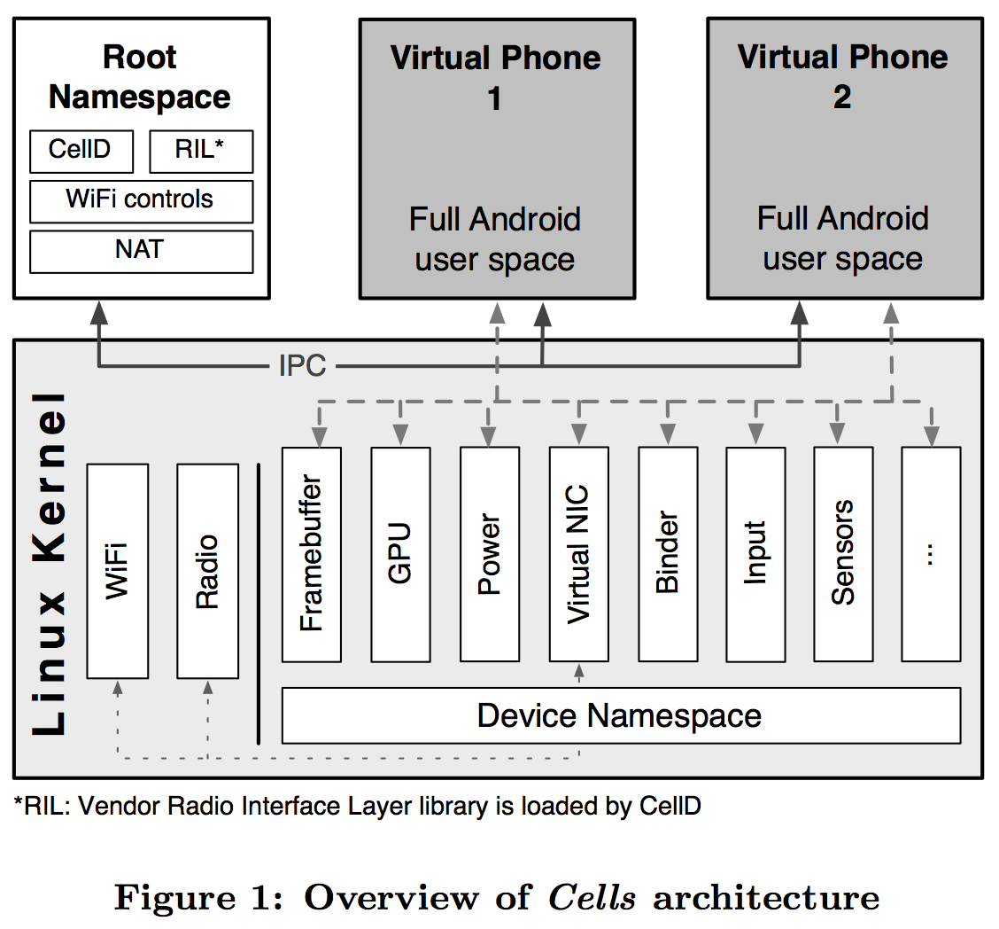

[Cells: A Virtual Mobile Smartphone Architecture](https://www.google.com/url?sa=t&rct=j&q=&esrc=s&source=web&cd=1&cad=rja&uact=8&ved=0ahUKEwi488vltvjKAhVM0WMKHbfhBl0QFggdMAA&url=http%3A%2F%2Fwww.cs.columbia.edu%2F~nieh%2Fpubs%2Fsosp2011_cells.pdf&usg=AFQjCNFe7C7Bypfv8N5_eKPMDwpqs3kXdA&sig2=a4J6y4YNWIMhrv-BBL5gpA)

# Cells

## intro

Cells是一个支持多个系统跑在一个物理设备上的手机系统. Cells introduces a usage model of having one foreground virtual phone and multiple background virtual phones. 也就是说, 在一个时刻前端只显示一个虚拟系统.

## USAGE MODEL

在一个时刻前端只显示一个VP,但是后台可以有很多其他VP同时在运行. 如果来短信和电话也可以自动切换. 跟切换应用的方法差不多, VP之间切换来切换去.

然后VP可以用USB下载, 用户也可以删除VP.

不同设备也可以有不同device access rights

1. no access
2. shared access
3. Exclusive access

## SYSTEM ARCHITECTURE

* Each VP runs a stock Android user space environment
* Each VP has its own private virtual namespace
* Three requirements for supporting devices must be met
  * support exclusive or shared access across VPs,
  * never leak sensitive information between VPs, and  
  * prevent malicious applications in a VP from interfering with device usage by other VPs.

### Kernel-Level Device Virtualization
1. create a device driver wrapper using a new device driver for a virtual device
2. modify a device subsystem to be aware of device namespaces
3. modify a device driver to be aware of device namespaces

### User-Level Device Virtualization

* user-level device namespace proxies which are contained in a root namespace
* The root namespace is considered part of the trusted computing base and processes in the root names- pace have full access to the entire file system

### Scalability and Security
Cells uses three scalability techniques to enable multiple VPs running the same Android environment to share code and reduce memory usage

1. the same base file system is shared read-only among VPs
2. when a new VP is started, Cells enables Linux Ker- nel Samepage Merging (KSM) for a short time to further reduce memory usage by finding anonymous memory pages used by the user space environment that have the same con- tents, then arranging for one copy to be shared among the various VPs
3. Cells leverages the Android low memory killer to increase the total number of VPs it is possi- ble to run on a device without sacrificing functionality

Cells uses four techniques to isolate all VPs from the root namespace and from one another

1. user credentials
2. kernel-level device namespaces isolate device access and associated data
3. mount namespaces provide a unique and separate FS view for each VP
4. CellD removes the capability to create device nodes inside a VP

## GRAPHICS

### Framebuffer
* Cells passes all accesses to the mux_fb device from the fore- ground VP directly to the hardware
* Cells does not pass any accesses to the mux_fb driver from background VPs to the hardware back end, ensuring that the foreground VP has exclusive hardware access

Switching the display from a foreground VP to a background VP is accomplished in four steps
1. screen memory remapping
2. screen memory deep copy
3. hardware state synchronization
4. GPU coordination

### GPU
The foreground VP will use the GPU to render directly into screen memory, but background VPs, which use the GPU, will render into their respective backing buffers.

## POWER MANAGEMENT

### Principle
1. background VPs should not be able to put the device into a low power mode, and
2. background VPs should not prevent the foreground VP from putting the device into a low power mode
